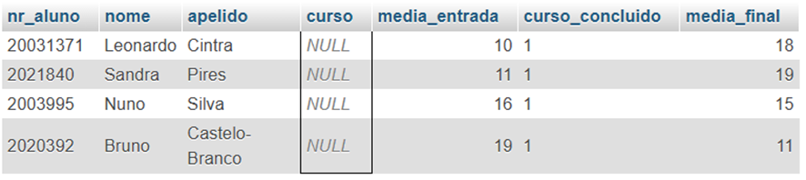
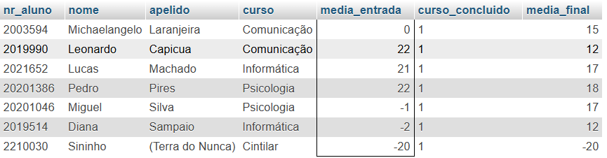

# Introdução

Conforme solicitado no e-mail referente a etapa inicial do projeto, verificou-se as informações.

## 1. Verificação de inconsistências

### 1.1. Valores nulos:
Através da colsulta verificou-se a existência de valores nulos na coluna 'curso'

SELECT * FROM `aluno` WHERE `curso` IS NULL;

### 1.2. Cursos fora do especificado

A tabela deve conter informações sobre os seguintes cursos:

- Informática
- Psicologia
- Comunicação

SELECT * FROM `aluno` WHERE `curso` NOT IN ('Informática', 'Psicologia', 'Comunicação');

### 1.3.Verificação das médias de entrada e saída

Médias de entrada fora do range

SELECT * FROM `aluno` WHERE `media_entrada`< 10 OR `media_entrada` >20;

Alunos que conluíram o curso com notas fora do range

SELECT * FROM `aluno` WHERE` media_final`< 10 OR `media_final` >20;

Alunos que concluiram o curso e não tem a média final

SELECT * FROM `aluno` WHERE `media_final` IS NULL AND `curso_concluido` = 1;

## 2. Verificação das relações entre média de entrada e média final

Verificando a correlação entre as variáveis, observou-se um fenômeno inconsistente:

A correlação calculada indica que as médias se comportam de forma inversamente proporcionais, ou seja, quanto maior a nota de entrada, menor a nota de saída e vice-versa. Faz sentido?