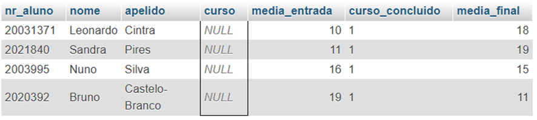
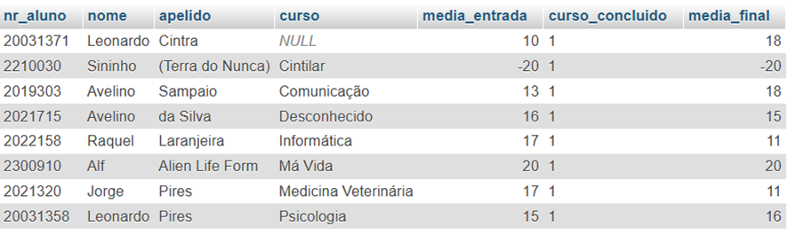
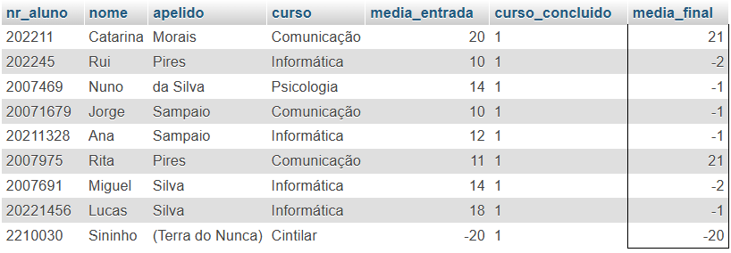
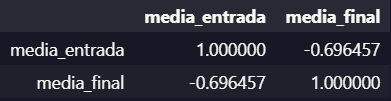
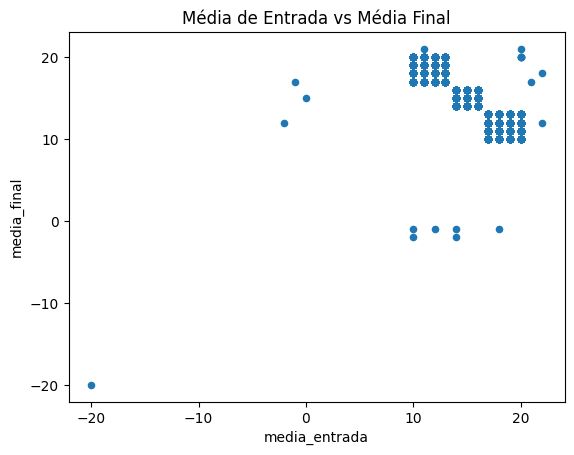
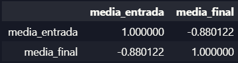
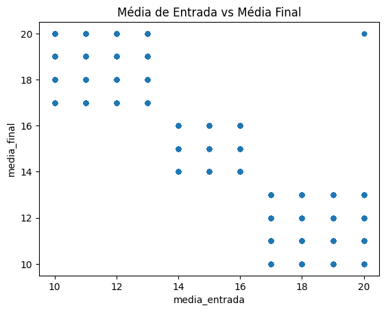

# Relatório de Desenvolvimento: Projeto TED
---

## 1. Extração e Carregamento de Dados
O projeto utiliza Python com a biblioteca Pandas para interagir com a base de dados SQL da Universidade. O carregamento inicial foi realizado via SQLAlchemy para garantir a integridade dos tipos de dados.

## 2. Diagnóstico de Qualidade de Dados
Com base nas análises realizadas no Notebook e nas consultas SQL, foram identificadas as seguintes inconsistências:

### 2.1. Problemas de Domínio e Valores Nulos
Identificou-se que a coluna `curso` possui registros inválidos, incluindo valores nulos e cursos que não pertencem ao escopo do projeto (Informática, Psicologia e Comunicação).

* **Registros Nulos:**

* **Cursos Inválidos:**

### 2.2. Inconsistências em Médias Acadêmicas
Foram detectados valores fora do intervalo regulamentar (10 a 20):
* **Médias de Entrada:** Registros com valores impossíveis para a escala acadêmica.

* **Médias Finais:** Alunos com curso concluído sem nota atribuída ou notas fora do range.

## 3. Separação de Dados Válidos e Inválidos
Para cumprir os requisitos de qualidade, foi implementada uma lógica de filtragem em Python. Os dados foram divididos em dois fluxos distintos:

### 3.1. Critérios de Exclusão (Dados Inválidos)
Um registro é considerado inválido e movido para auditoria se apresentar qualquer uma das seguintes condições:
* **Curso Inexistente:** Registros nulos ou cursos que não sejam Informática, Psicologia ou Comunicação.
* **Notas Fora do Range:** Médias (entrada ou final) menores que 10 ou maiores que 20.
* **Inconsistência de Estado:** Alunos com `curso_concluido = 1` mas sem `media_final`.

### 3.2. Geração de Outputs
Conforme implementado no código, o sistema gera dois arquivos de saída:
1. **`dados_validos.csv`**: Apenas registros íntegros.
2. **`dados_invalidos.txt`**: Relatório de erros para auditoria.

## 4. Análise de Correlação: Impacto da Limpeza
A análise de correlação entre `media_entrada` e `media_final` foi realizada em dois momentos para validar se as inconsistências eram a causa do comportamento atípico dos dados.

### 4.1. Cenário Inicial (Dados Brutos)
Nos dados originais, a correlação apresentou-se **inversamente proporcional**. Suspeitou-se que os registros com notas fora do range (ex: notas > 20) e alunos concluídos sem nota final estivessem a distorcer a tendência estatística.

### 4.2. Cenário Pós-Separação (Dados Válidos)
Após a filtragem rigorosa e a utilização apenas da dataframe `dados_validos.csv`, procedeu-se à nova análise.
* **Resultado Observado:** A correlação **manteve-se inversamente proporcional**, sugerindo que, nesta amostra da Universidade do País das Maravilhas, alunos com melhores notas de entrada tendem a apresentar notas finais mais baixas.

* **Conclusão Técnica:** A limpeza confirmou que este fenômeno não é um erro de processamento (ruído), mas sim uma característica intrínseca dos dados fornecidos. Este ponto é crítico para o Cientista de Dados, pois indica que as variáveis de entrada e saída possuem uma relação oposta à esperada no domínio acadêmico tradicional.
